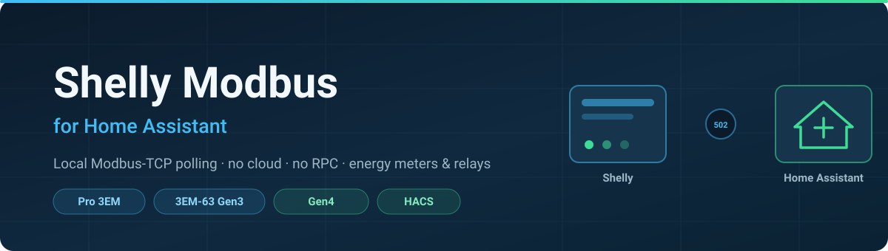
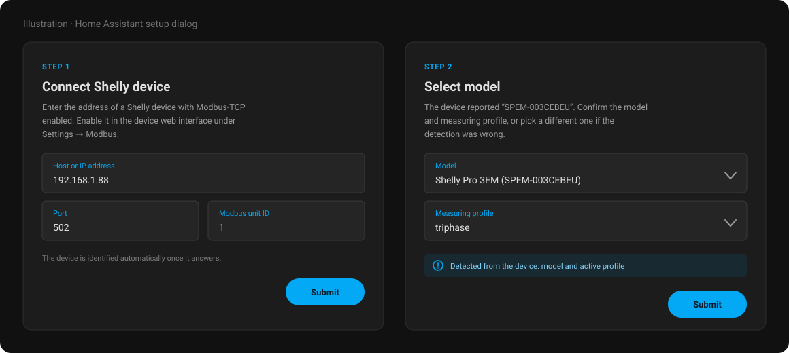
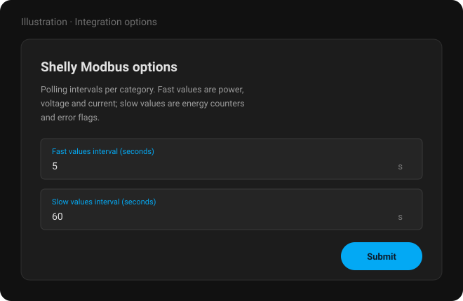
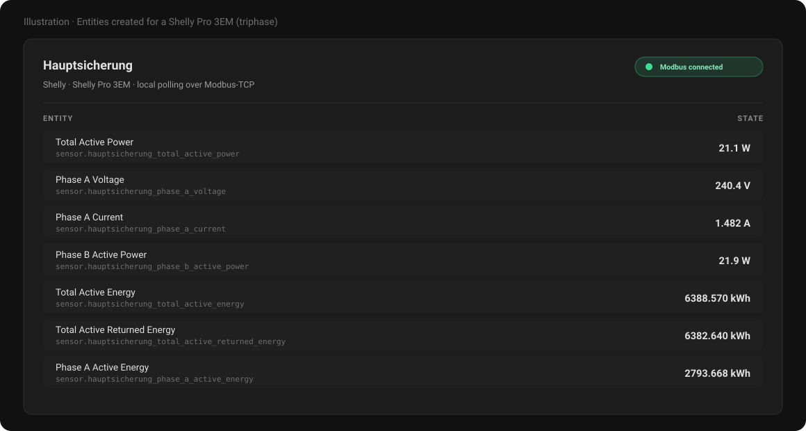
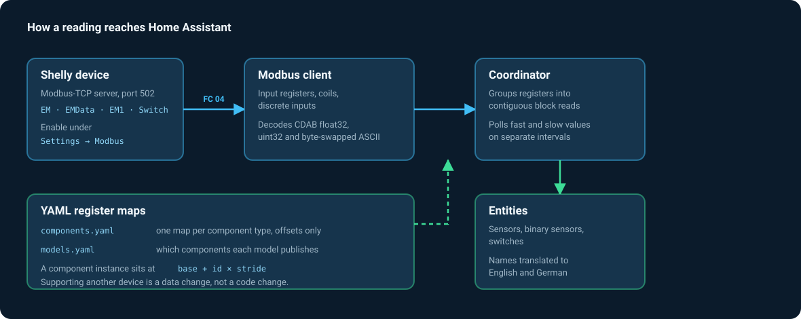

<div align="center">



# Shelly Modbus für Home Assistant

**Shelly-Energiezähler und -Relais über lokales Modbus-TCP auslesen — ohne Cloud, ohne RPC-Polling.**

[](https://hacs.xyz)
[](https://github.com/sphings79/shelly-modbus-home-assistant/actions/workflows/validate.yml)
[](LICENSE)
[](https://www.home-assistant.io)

[English](README.md) · **Deutsch**

</div>

---

## Was diese Integration macht

Die Shelly-Energiezähler der Generationen 2, 3 und 4 bringen einen **Modbus-TCP-Server** direkt in
der Firmware mit. Diese Custom-Integration für [Home Assistant](https://www.home-assistant.io)
spricht diesen Server direkt an: Sie öffnet eine TCP-Verbindung auf Port 502, liest die
Input-Register des Geräts in gebündelten Blöcken und macht daraus Home-Assistant-Entitäten.

Alles bleibt im eigenen Netz. Kein Shelly-Cloud-Konto, kein MQTT-Broker, kein HTTP/RPC-Polling.

### Warum Modbus statt der eingebauten Shelly-Integration?

Die offizielle Shelly-Integration ist ausgezeichnet und für die meisten die richtige Wahl. Modbus
lohnt sich, wenn man Folgendes braucht:

| | Modbus-TCP (diese Integration) | Offizielle Shelly-Integration |
|---|---|---|
| Transport | Rohes TCP, eine dauerhafte Verbindung | HTTP/RPC + WebSocket |
| Aufwand pro Messwert | Wenige Bytes je Registerblock | Ein JSON-Dokument je Anfrage |
| Cloud-Abhängigkeit | Keine | Keine (lokales Push möglich) |
| Aktualisierungsrate | Frei einstellbar, bis zu 1 s | Vom Gerät vorgegeben |
| Interoperabilität | Dieselben Register, die auch Wechselrichter, SPS oder Venus GX lesen | Nur Home Assistant |
| Entitäten-Umfang | Genau die Register, die man aktiviert | Alles, was das Gerät hergibt |

Der praktische Fall: Der Zähler wird ohnehin schon von woanders über Modbus gelesen (Hybrid-
Wechselrichter, Loxone oder SPS, Victron Venus) — und Home Assistant soll **dieselben Zahlen aus
derselben Quelle** sehen, in einem selbst gewählten Intervall.

---

## Oberfläche

> Die folgenden Bilder sind Illustrationen der Dialoge, keine Fotos einer laufenden Instanz.

<div align="center">

</div>

Das Gerät wird automatisch erkannt — die Integration liest die Modellkennung direkt aus den
Registern des Geräts und wählt sie vor. Die Auswahl lässt sich jederzeit überschreiben.

<div align="center">

</div>

<div align="center">

</div>

---

## Unterstützte Geräte

Alle Shelly-Geräte, deren Firmware einen Modbus-Server bereitstellt. Dieser muss zuerst
aktiviert werden — siehe [Modbus aktivieren](#1-modbus-am-gerät-aktivieren).

### Energiezähler

| Gerät | Modellcode | Generation | Status |
|---|---|---|---|
| Shelly Pro 3EM | `SPEM-003CEBEU` | Gen2 | ✅ **An Hardware verifiziert** |
| Shelly Pro 3EM-3CT63 | `SPEM-003CEBEU63` | Gen2 | Registerkarte identisch zum Pro 3EM |
| Shelly Pro 3EM-120 | `SPEM-003CEBEU120` | Gen2 | Registerkarte identisch zum Pro 3EM |
| Shelly Pro 3EM-400 | `SPEM-003CEBEU400` | Gen2 | Registerkarte identisch zum Pro 3EM |
| Shelly Pro EM 50 | `SPEM-002CEBEU50` | Gen2 | Aus der Dokumentation |
| Shelly 3EM-63 Gen3 | `S3EM-003CXCEU63` | Gen3 | ✅ **An Hardware verifiziert** |
| Shelly EM Gen3 | `S3EM-002CXCEU` | Gen3 | Aus der Dokumentation |
| Shelly EM Mini Gen4 | `S4EM-001PXCEU16` | Gen4 | Aus der Dokumentation |
| Shelly EM 63 Gen4 | `S4EM-001CXCEU63` | Gen4 | Aus der Dokumentation |

### Schalter und Relais

| Gerät | Modellcode | Messung | Status |
|---|---|---|---|
| Shelly 1 Gen4 | `S4SW-001X16EU` | — | Aus der Dokumentation |
| Shelly 1 Mini Gen4 | `S4SW-001X8EU` | — | Aus der Dokumentation |
| Shelly 1L Gen4 | `S4SW-0A1X1EUL` | — | Aus der Dokumentation |
| Shelly 1PM Gen4 | `S4SW-001P16EU` | ✅ | Aus der Dokumentation |
| Shelly 1PM Mini Gen4 | `S4SW-001P8EU` | ✅ | Aus der Dokumentation |
| Shelly 2PM Gen4 | `S4SW-002P16EU` | ✅ | Aus der Dokumentation |
| Shelly 2L Gen4 | `S4SW-0A2X4EUL` | — | Aus der Dokumentation |

**„An Hardware verifiziert"** heißt: Jedes Register wurde von einem physischen Gerät gelesen und
jeder dekodierte Wert mit der RPC-Ausgabe desselben Geräts verglichen — siehe
[Verifikation](#verifikation). Die übrigen Einträge folgen den veröffentlichten Registerkarten von
Shelly und demselben Komponentenaufbau, sind aber nicht an echter Hardware bestätigt.
Rückmeldungen gerne über [Issues](https://github.com/sphings79/shelly-modbus-home-assistant/issues).

> **Nicht unterstützt:** Shelly-Plus-/Pro-Geräte ohne Modbus-Server (Plus 1PM, Plus Plug S,
> Pro 4PM, …) sowie alle Gen1-Geräte. Deren Firmware hat keinen Modbus-Server — dafür ist die
> offizielle Shelly-Integration das Richtige.

### Messprofile

Die dreiphasigen Zähler laufen wahlweise als **ein Dreiphasenzähler** (`triphase`) oder als **drei
unabhängige Einphasenzähler** (`monophase`). Das ändert die vorhandenen Modbus-Komponenten
komplett. Die Integration ermittelt das aktive Profil selbst und lässt es überschreiben.

---

## Installation

### Variante A — HACS (empfohlen)

1. **HACS** in Home Assistant öffnen.
2. Im Drei-Punkte-Menü → **Benutzerdefinierte Repositories**.
3. `https://github.com/sphings79/shelly-modbus-home-assistant` mit Kategorie **Integration**
   hinzufügen.
4. Nach **Shelly Modbus** suchen und installieren.
5. Home Assistant neu starten.

### Variante B — manuell

1. Das aktuelle Release herunterladen.
2. Den Ordner `custom_components/shelly_modbus` nach `config/custom_components/` kopieren.
   Ergebnis muss `config/custom_components/shelly_modbus/manifest.json` sein.
3. Home Assistant neu starten.

---

## Einrichtung

### 1. Modbus am Gerät aktivieren

Modbus ist bei jedem Shelly-Gerät **ab Werk deaktiviert**.

- **Weboberfläche:** IP-Adresse des Geräts im Browser öffnen → **Einstellungen** → **Modbus** →
  aktivieren.
- **Oder per RPC:**

  ```bash
  curl -X POST -d '{"id":1,"method":"Modbus.SetConfig","params":{"config":{"enable":true}}}' \
    http://<geräte-ip>/rpc
  ```

Kontrolle:

```bash
curl -s http://<geräte-ip>/rpc/Modbus.GetConfig
```

Die Ausgabe muss `{"enable":true}` lauten.

### 2. Integration hinzufügen

**Einstellungen → Geräte & Dienste → Integration hinzufügen**, dann nach **Shelly Modbus** suchen.
Geräte, die sich per mDNS ankündigen, werden automatisch gefunden.

Host eingeben, danach das erkannte Modell und Profil bestätigen.

| Feld | Bedeutung | Standard |
|---|---|---|
| Host oder IP-Adresse | Adresse des Geräts. Feste IP oder DHCP-Reservierung dringend empfohlen. | — |
| Port | Modbus-TCP-Port. Shelly nutzt immer 502. | `502` |
| Modbus-Unit-ID | Wird von Shelly ignoriert; nur hinter einem Gateway relevant. | `1` |
| Modell | Aus den Geräteregistern erkannt, überschreibbar. | erkannt |
| Messprofil | `triphase` oder `monophase` bei Dreiphasenzählern. | erkannt |

### 3. Abfrageintervalle einstellen

**Einstellungen → Geräte & Dienste → Shelly Modbus → Konfigurieren**

Die Register sind in zwei Kategorien aufgeteilt, jede mit eigenem Intervall:

| Kategorie | Standard | Bereich | Enthält |
|---|---|---|---|
| **Schnelle Werte** | **5 s** | 1–3600 s | Wirk- und Scheinleistung, Spannung, Strom, Leistungsfaktor, Schaltzustände |
| **Langsame Werte** | **60 s** | 5–86400 s | Energiezähler, Frequenz, Fehler- und Diagnosemeldungen |
| Geräteidentität | einmalig | — | MAC, Modell, Gerätename |

**Warum 5 Sekunden.** Ein schneller Zyklus sind drei Modbus-Blockabfragen und dauert auf einem
Pro 3EM 70–100 ms. Der Standard hält das Gerät damit bei rund 2 % Auslastung. Nach unten ist
reichlich Luft: bei 3 s sind es etwa 3 %, bei 1 s etwa 10 %. Wer aus diesen Werten eine
Nulleinspeisung oder Batteriesteuerung regelt, kann bedenkenlos auf 1–2 s gehen. Höher stellen
sollte man es, wenn das Gerät an schwachem WLAN hängt oder mehrere Modbus-Clients darauf
zugreifen.

Die Geräteidentität wird einmal beim Start gelesen und danach nie wieder abgefragt.

> **Tipp:** Nicht benötigte Entitäten zu deaktivieren reduziert den Modbus-Verkehr tatsächlich —
> der Coordinator liest nur Register, hinter denen eine aktive Entität steht.

---

## Entitäten

Die Entitätsnamen liegen auf **Deutsch und Englisch** vor und richten sich nach der
Spracheinstellung von Home Assistant.

### Dreiphasenzähler (`triphase`)

| Entität | Einheit | Geräteklasse | Standardmäßig aktiv |
|---|---|---|---|
| Gesamte Wirkleistung | W | power | ✅ |
| Gesamtstrom | A | current | ✅ |
| Gesamte Scheinleistung | VA | apparent_power | — |
| Phase A/B/C Spannung | V | voltage | ✅ |
| Phase A/B/C Strom | A | current | ✅ |
| Phase A/B/C Wirkleistung | W | power | ✅ |
| Phase A/B/C Scheinleistung | VA | apparent_power | — |
| Phase A/B/C Leistungsfaktor | — | power_factor | — |
| Phase A/B/C Frequenz | Hz | frequency | — |
| Neutralleiterstrom | A | current | — |
| Gesamte Wirkenergie | kWh | energy | ✅ |
| Gesamte eingespeiste Wirkenergie | kWh | energy | ✅ |
| Netzbezug Leistung (saldiert) | W | power | ✅ |
| Netzeinspeisung Leistung (saldiert) | W | power | ✅ |
| Netzbezug Energie (saldiert) | kWh | energy | ✅ |
| Netzeinspeisung Energie (saldiert) | kWh | energy | ✅ |
| Phase A/B/C Wirkenergie | kWh | energy | ✅ |
| Phase A/B/C Eingespeiste Wirkenergie | kWh | energy | ✅ |
| Zähler-, Überspannungs-, Überstrom-, Überlastfehler | — | problem | — |
| Modbus-Verbindung | — | connectivity | ✅ |

### Einphasenkanal (`monophase`, Pro EM, EM Gen3/Gen4)

Spannung, Strom, Wirkleistung, Scheinleistung, Leistungsfaktor, Frequenz, Wirkenergie,
eingespeiste Wirkenergie sowie die Fehlermeldungen — je Kanal ein Satz, benannt als `Kanal 1`,
`Kanal 2`, …

### Schalter

Ausgang (schaltbar), dazu Spannung, Strom, Wirkleistung, Frequenz, Leistungsfaktor, Wirkenergie
und Fehlermeldungen bei Modellen mit Leistungsmessung. Physische Eingänge erscheinen als
Binärsensoren.

### Saldierte Netzleistung — vor dem Energie-Dashboard lesen

Die Energiezähler von Shelly **saldieren nicht über die Phasen**. Jede Phase führt eigene
Bezugs- und Einspeisezähler, und das Gerät addiert diese nur auf. Bei einem deutschen
Zweirichtungszähler, der über alle drei Phasen saldiert, entstehen dadurch massiv
überhöhte Werte.

Der klassische Fall — PV speist auf einer Phase ein, während das Haus auf den anderen bezieht:

| | Phase A | Phase B | Phase C | Summe |
|---|---|---|---|---|
| Leistung | −600 W | +50 W | +550 W | **0 W** |
| Ein saldierender Zähler erfasst | | | | nichts |
| Die Shelly-Zähler erfassen | 600 Wh Einspeisung | 50 Wh Bezug | 550 Wh Bezug | 600 Wh Einspeisung **und** 600 Wh Bezug |

An einem Pro 3EM nachgemessen: `total_act_power` (Register 31013) **ist** korrekt saldiert,
`total_act_energy` (31162) dagegen nur die Summe der Phasenzähler.

Deshalb erhalten Dreiphasenzähler vier zusätzliche Sensoren — **ganz ohne Helfer**:

| Entität | Einheit | Bedeutung |
|---|---|---|
| **Netzbezug Leistung (saldiert)** | W | `max(0, Summe aller Phasenleistungen)` |
| **Netzeinspeisung Leistung (saldiert)** | W | `max(0, −Summe aller Phasenleistungen)` |
| **Netzbezug Energie (saldiert)** | kWh | die Bezugsleistung, über die Zeit integriert |
| **Netzeinspeisung Energie (saldiert)** | kWh | die Einspeiseleistung, über die Zeit integriert |

Die Leistungssensoren stammen aus der bereits saldierten, vorzeichenbehafteten Leistung und
verhalten sich damit wie ein saldierender Zähler. Die beiden Energiezähler integrieren sie
nach der Trapez-Regel — dieselbe Methode, die auch der Riemann-Helfer von Home Assistant
verwendet. Sie können also direkt ins Energie-Dashboard unter **Netzbezug** und
**Einspeisung ins Netz**.

Die Zählerstände überstehen Neustarts von Home Assistant. Liegen zwei Messungen mehr als
15 Minuten auseinander oder schlägt eine fehl, wird die Kette unterbrochen statt darüber
hinweg integriert — ein Ausfall kann so keine Energie erfinden.

**Sie starten bei null.** Vergangene Energie lässt sich nicht rekonstruieren: Die
Gerätezähler haben nie saldiert, und diese Information ist aus ihnen nicht wiederherstellbar.
Die geräteeigenen Sensoren `Gesamte Wirkenergie` laufen unverändert daneben weiter.

Ein kürzeres Intervall für schnelle Werte tastet die Leistung häufiger ab und macht die
Zähler genauer; 1–2 s sind sinnvoll. Siehe
[Abfrageintervalle](#3-abfrageintervalle-einstellen).

### Energie-Dashboard

Bei Einphasenzählern, oder wenn der eigene Netzzähler tatsächlich je Phase abrechnet, sind
die geräteeigenen Sensoren `Gesamte Wirkenergie` und `Gesamte eingespeiste Wirkenergie`
Lebensdauer-Zählerstände mit `state_class: total_increasing` und direkt verwendbar.

---

## Funktionsweise

<div align="center">

</div>

### Die drei Dinge, die Shellys Dokumentation nicht ausspricht

An drei Details entscheidet sich, ob Shelly-Modbus funktioniert. Alle drei wurden an echter
Hardware bestätigt.

**1. Die dokumentierten Adressen sind nicht die Adressen auf der Leitung.**
Shelly dokumentiert seine Register in der klassischen `3xxxx`-Input-Register-Schreibweise. Die
tatsächlich gesendete Adresse ist diese Zahl **minus 30000**. Das dokumentierte `31020` (Spannung
Phase A) wird als Input-Register `1020` gelesen. Alles läuft über **Funktionscode 0x04**
(Input-Register lesen) — Holding-Register sind gar nicht implementiert und liefern eine Exception.

**2. 32-Bit-Werte sind wortvertauscht.**
`float32` und `uint32` belegen zwei Register, dabei steht das **niederwertige Wort zuerst** (CDAB).
Wer sie in normaler Big-Endian-Reihenfolge liest, bekommt plausibel aussehenden Unsinn: Das
Registerpaar für 240,4 V wird zu `1,65e16`.

**3. Zeichenketten sind innerhalb jedes Registers bytevertauscht.**
Die ASCII-Register der Geräteidentität legen ihre zwei Bytes je Register in umgekehrter
Reihenfolge ab. Big-Endian gelesen wird aus der MAC `A0DD6CA0E0CC` ein `0ADDC60A0ECC`.

### Registeraufbau

Jeder Komponententyp hat eine Registerkarte mit Offsets; eine Instanz liegt bei
`base + id × stride`:

| Komponente | Basis (Leitung) | Dokumentiert | Stride | Inhalt |
|---|---|---|---|---|
| Geräteidentität | 0 | 30000 | — | MAC, Modell, Name |
| `em` | 1000 | 31000 | 80 | Dreiphasige Momentanwerte |
| `emdata` | 1160 | 31160 | 70 | Dreiphasige Energiezähler |
| `em1` | 2000 | 32000 | 20 | Einphasige Kanalmesswerte |
| `em1data` | 2300 | 32300 | 20 | Einphasige Kanal-Energiezähler |
| `switch` | 3000 | 33000 | 20 | Relaiszustand und Messung |
| Coils (Relaissteuerung) | 100 | — | 10 | Schaltbarer Ausgang |
| Discrete Inputs | 100 | — | 10 | Zustand physischer Eingänge |

Das steht in [`components.yaml`](custom_components/shelly_modbus/registers/components.yaml) und
[`models.yaml`](custom_components/shelly_modbus/registers/models.yaml). **Ein neues Gerät zu
unterstützen ist eine Daten-, keine Codeänderung.**

### Effizientes Lesen

Register werden zu zusammenhängenden Blöcken gruppiert und je Block in einer Anfrage gelesen. Ein
Shelly Pro 3EM mit allen Standard-Entitäten sind **drei Modbus-Anfragen pro Zyklus**, nicht 69.
Blöcke überschreiten nie eine Komponentengrenze (die Lücken dazwischen sind unbelegt und liefern
eine Exception) und nie 80 Register, das Limit der Firmware pro Anfrage.

---

## Verifikation

Die Registerkarte ist nicht bloß aus der Dokumentation abgeschrieben. Das Repository enthält
einen Live-Test, der den Code der Integration gegen ein physisches Gerät laufen lässt und jeden
dekodierten Wert mit dem vergleicht, was dasselbe Gerät über seine RPC-Schnittstelle meldet:

```bash
python3 tests/live_test.py 192.168.1.88
```

```
========================================================================
192.168.1.88  SPEM-003CEBEU  gen2  profile=triphase  fw=2.0.0
  69 definitions in 3 block reads
  identity: model='SPEM-003CEBEU' mac='A0DD6CA0E0CC'
  compared 29 values against RPC, 0 mismatched, 0 failed blocks
  decoded 68/69 registers
========================================================================
PASS: all 1 device(s) verified
```

Die Unit-Tests laufen ohne Hardware und ohne Home Assistant:

```bash
pip install pytest pyyaml pymodbus
python3 -m pytest tests/
```

Sie prüfen die Dekodierung anhand echter Registerwerte, die Adressberechnung für alle Modelle und
Profile, die Blockplanung und die Vollständigkeit der Übersetzungen.

---

## Fehlerbehebung

<details>
<summary><b>„Gerät unter dieser Adresse nicht erreichbar"</b></summary>

Mit hoher Wahrscheinlichkeit ist Modbus noch deaktiviert. Prüfen:

```bash
curl -s http://<geräte-ip>/rpc/Modbus.GetConfig
```

Kommt `{"enable":false}` zurück, Modbus wie unter
[Modbus aktivieren](#1-modbus-am-gerät-aktivieren) einschalten. Kommt gar nichts zurück, ist das
Gerät nicht erreichbar oder unterstützt kein Modbus.

Danach prüfen, ob Port 502 offen ist:

```bash
nc -vz <geräte-ip> 502
```
</details>

<details>
<summary><b>„Verbindung steht, aber das Gerät stellt keine bekannten Modbus-Komponenten bereit"</b></summary>

Der Modbus-Server antwortet, aber kein bekannter Komponentenblock. Das passiert bei Modellen, die
Modbus mit Komponenten umsetzen, die diese Integration noch nicht kennt. Bitte ein
[Issue eröffnen](https://github.com/sphings79/shelly-modbus-home-assistant/issues) und die Ausgabe
von Folgendem beilegen:

```bash
curl -s http://<geräte-ip>/rpc/Shelly.GetDeviceInfo
curl -s "http://<geräte-ip>/rpc/Shelly.GetComponents?dynamic_only=false"
```
</details>

<details>
<summary><b>Werte sind absurd (z. B. 1,65e16 V)</b></summary>

Das ist die typische Signatur einer falschen Wortreihenfolge. Diese Integration behandelt Shellys
Wortreihenfolge korrekt — tritt der Fehler dennoch auf, liefert das Gerät vermutlich ein Register,
das hier auf den falschen Datentyp abgebildet ist. Bitte ein Issue mit Modell und betroffener
Entität eröffnen.
</details>

<details>
<summary><b>Falsche Anzahl Phasen oder Kanäle</b></summary>

Das Messprofil stimmt nicht. Integration entfernen und neu hinzufügen, dabei im Modellschritt das
andere Profil wählen. Am Gerät selbst liegt das Profil unter **Einstellungen → Messprofil**.
</details>

<details>
<summary><b>Entitäten werden nach einiger Zeit „nicht verfügbar"</b></summary>

Shelly-Geräte akzeptieren nur eine begrenzte Zahl gleichzeitiger Modbus-Verbindungen. Ist noch ein
anderer Client verbunden (Wechselrichter, SPS, zweite Home-Assistant-Instanz), kann das Gerät die
eigene Verbindung trennen. Abfrageintervalle erhöhen oder die Zahl der Clients reduzieren.
</details>

<details>
<summary><b>Debug-Protokollierung aktivieren</b></summary>

```yaml
# configuration.yaml
logger:
  default: warning
  logs:
    custom_components.shelly_modbus: debug
```
</details>

---

## Mitwirken

Ein Gerät hinzuzufügen bedeutet meist, einen Eintrag in
[`models.yaml`](custom_components/shelly_modbus/registers/models.yaml) zu ergänzen — ganz ohne
Python. Nutzt das Gerät eine noch nicht abgebildete Komponente, kommt sie in
[`components.yaml`](custom_components/shelly_modbus/registers/components.yaml).

Vor einem Pull Request:

```bash
python3 -m pytest tests/          # Unit-Tests
ruff check custom_components tests
ruff format --check custom_components tests
```

Wer Hardware hat, hängt bitte die Ausgabe von `tests/live_test.py` für sein Gerät an.

---

## Danksagung

- Registersemantik aus der
  [Shelly-Gen2+-API-Dokumentation](https://shelly-api-docs.shelly.cloud/gen2/ComponentsAndServices/Modbus/).
- Architektur inspiriert von
  [ViperRNMC/marstek_venus_modbus](https://github.com/ViperRNMC/marstek_venus_modbus), dessen
  YAML-getriebenem Registeransatz diese Integration folgt.
- Wortreihenfolge gegengeprüft mit
  [pipelka/dbus-modbus-shelly](https://github.com/pipelka/dbus-modbus-shelly).

---

## ☕ Unterstützen

Diese Tools entstehen in meiner Freizeit und bleiben kostenlos, quelloffen und cloudfrei.
Wenn dir eines davon einen Nachmittag gespart hat, kannst du mir [einen Kaffee ausgeben](https://buymeacoffee.com/sphings).

[](https://buymeacoffee.com/sphings)

## Lizenz

[MIT](LICENSE)

---

<div align="center">
<sub>

**Stichwörter:** Home Assistant · Shelly · Modbus · Modbus TCP · HACS · Custom Integration ·
Energiemessung · Shelly Pro 3EM · Shelly 3EM-63 Gen3 · Shelly EM Gen4 · Stromzähler ·
lokale Abfrage · Energie-Dashboard · Photovoltaik · Nulleinspeisung

</sub>
</div>
